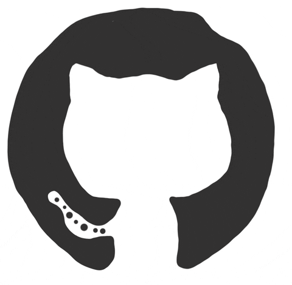
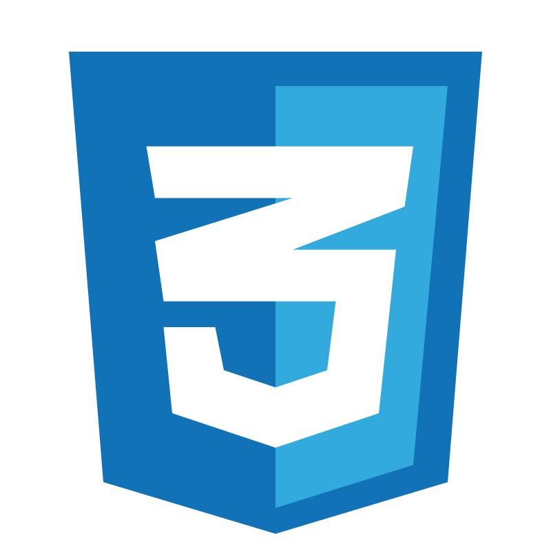
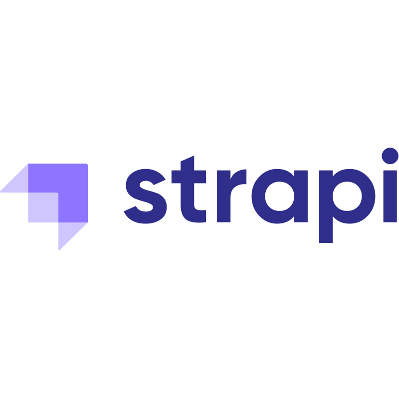
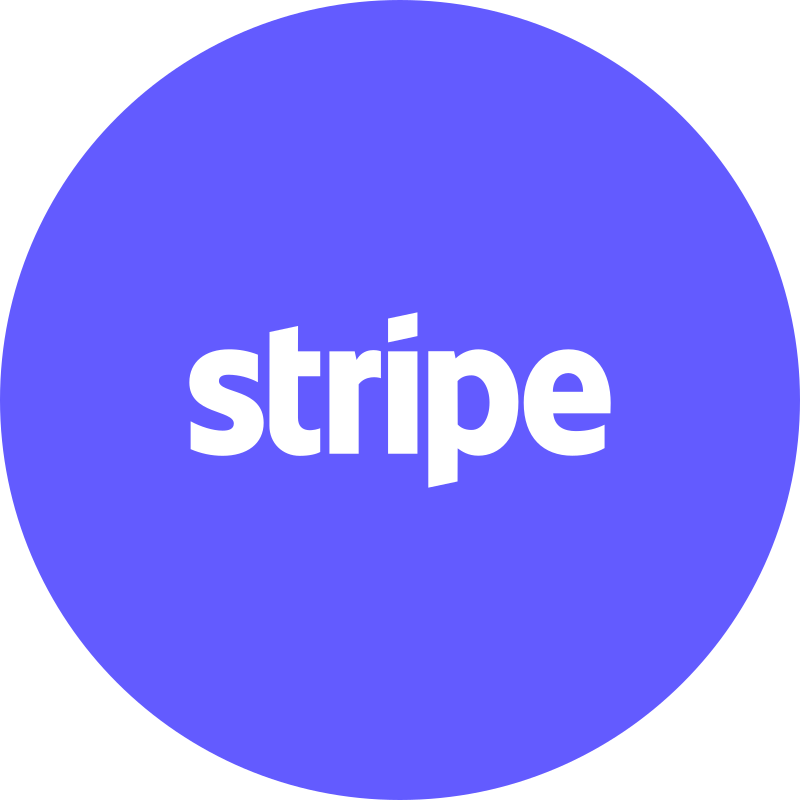
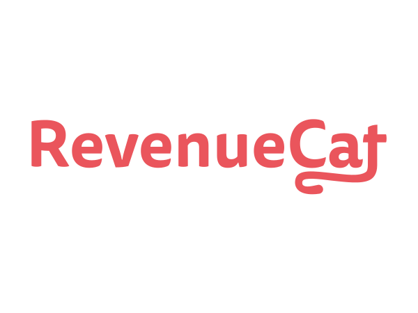
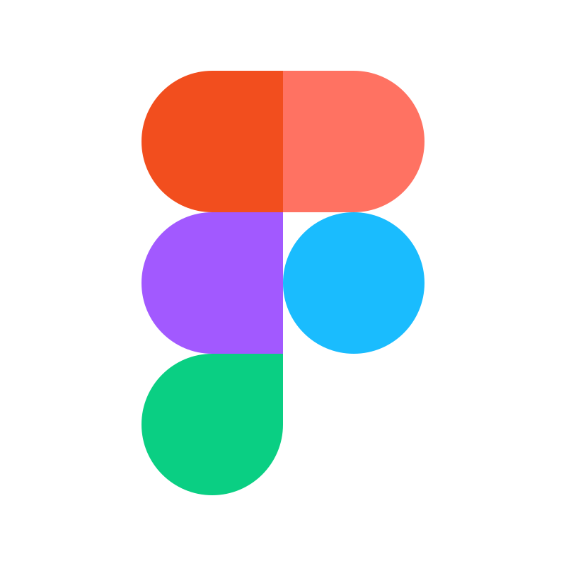
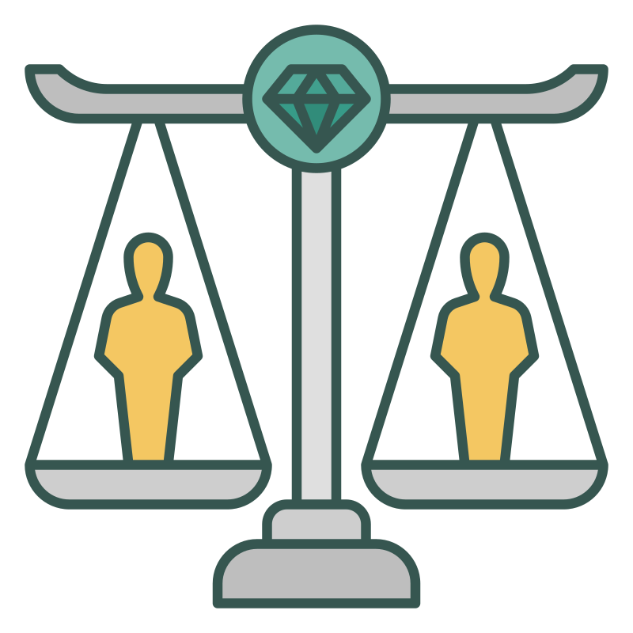
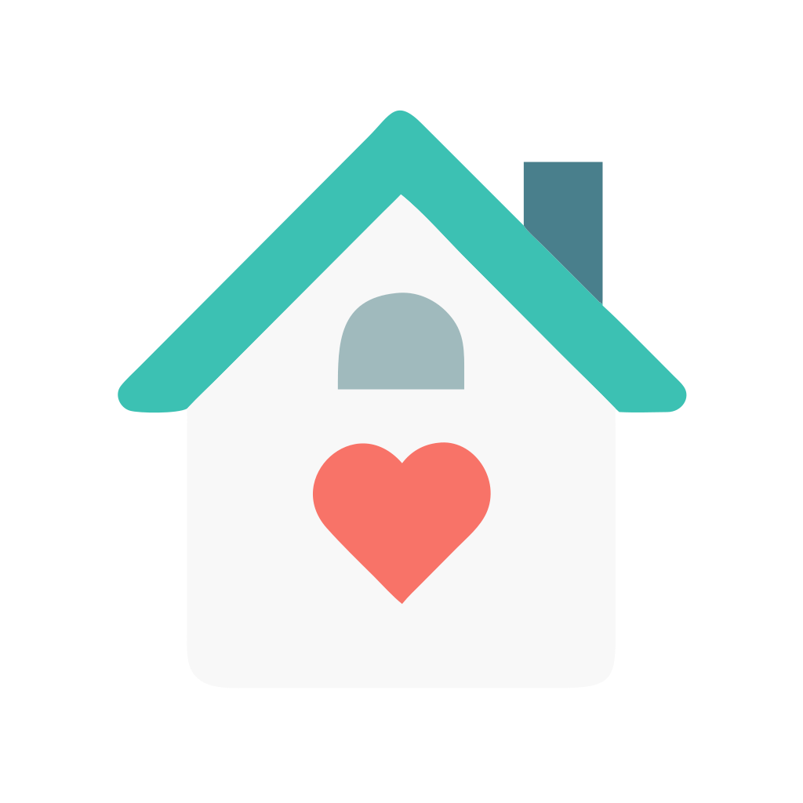

 
<div id="header" align="center">
  
  <h1>
    Hey there, I'm Maksym!
    
  </h1>
</div>

<br>

# 🧠 PROFILE

🎯 **Full-Stack Developer (Web & Mobile Apps)**  
🌍 Based in Ukraine  

📈 Built a price-comparison SaaS:  
  → $150k/mo profit  
  → 1M+ users/mo in Year 1  

💬 Over 6 years of hands-on commercial experience in:

```
Web · Mobile · APIs · Realtime · Optimization
```

---

<br>

# 🌐 LANGUAGES

 **Ukrainian** - Native |  **English** - Upper-Intermediate

---

<br>

# 🛠 CORE STACK
  <table>
    <tr>
      <td align="center" width="88"><br>JavaScript</td>
      <td align="center" width="88"><br>TypeScript</td>
      <td align="center" width="88"><br>Python</td>
      <td align="center" width="88"><br>HTML</td>
      <td align="center" width="88"><br>CSS</td>
      <td align="center" width="88"><br>Sass</td>
      <td align="center" width="88"><br>SCSS</td>
    </tr>
    <tr>
      <td align="center" width="88"><br>Less</td>
      <td align="center" width="88"><br>React.js</td>
      <td align="center" width="88"><br>Next.js</td>
      <td align="center" width="88"><br>React Native</td>
      <td align="center" width="88"><br>Expo</td>
      <td align="center" width="88"><br>Tailwind</td>
      <td align="center" width="88"><br>MUI</td>
    </tr>
    <tr>
      <td align="center" width="88"><br>ShadCN</td>
      <td align="center" width="88"><br>Redux</td>
      <td align="center" width="88"><br>Zustand</td>
      <td align="center" width="88"><br>Node.js</td>
      <td align="center" width="88"><br>NestJS</td>
      <td align="center" width="88"><br>Express</td>
      <td align="center" width="88"><br>Django</td>
    </tr>
    <tr>
      <td align="center" width="88"><br>FastAPI</td>
      <td align="center" width="88"><br>Flask</td>
      <td align="center" width="88"><br>Strapi</td>
      <td align="center" width="88"><br>PostgreSQL</td>
      <td align="center" width="88"><br>MySQL</td>
      <td align="center" width="88"><br>MSSQL</td>
      <td align="center" width="88"><br>MongoDB</td>
    </tr>
    <tr>
      <td align="center" width="88"><br>SQLite</td>
      <td align="center" width="88"><br>SQLAlchemy</td>
      <td align="center" width="88"><br>Prisma ORM</td>
      <td align="center" width="88"><br>Redis</td>
      <td align="center" width="88"><br>JWT / OAuth</td>
      <td align="center" width="88"><br>WebSockets</td>
      <td align="center" width="88"><br>Firebase</td>
    </tr>
    <tr>
      <td align="center" width="88"><br>AWS</td>
      <td align="center" width="88"><br>Azure</td>
      <td align="center" width="88"><br>Docker</td>
      <td align="center" width="88"><br>Heroku</td>
      <td align="center" width="88"><br>Vercel</td>
      <td align="center" width="88"><br>Replit</td>
      <td align="center" width="88"><br>AppCenter</td>
    </tr>
    <tr>
      <td align="center" width="88"><br>TestFlight</td>
      <td align="center" width="88"><br>Play Store</td>
      <td align="center" width="88"><br>OpenAI</td>
      <td align="center" width="88"><br>ChatGPT</td>
      <td align="center" width="88"><br>Supabase</td>
      <td align="center" width="88"><br>Stripe</td>
      <td align="center" width="88"><br>PayPal</td>
    </tr>
    <tr>
      <td align="center" width="88"><br>RevenueCat</td>
      <td align="center" width="88"><br>Figma</td>
      <td align="center" width="88"><br>Swagger</td>
      <td align="center" width="88"><br>Postman</td>
      <td align="center" width="88"><br>Jira</td>
      <td align="center" width="88"><br>Trello</td>
      <td align="center" width="88"><br>CI/CD</td>
    </tr>
    <tr>
      <td colspan="7" align="center">
        <table>
          <tr>
            <td align="center" width="88"><br>i18n</td>
            <td align="center" width="88"><br>GitLab</td>
            <td align="center" width="88"><br>Unit Testing</td>
            <td align="center" width="88"><br>Selenium</td>
            <td align="center" width="88"><br>Playwright</td>
            <td align="center" width="88"><br>Cypress</td>
          </tr>
        </table>
      </td>
    </tr>
  </table>


---

<br>

# 🧩 INDUSTRIES SERVED
  <table>
    <tr>
      <td align="center" width="88">
        <br>SaaS
      </td>
      <td align="center" width="88">
        <br>E-commerce
      </td>
      <td align="center" width="88">
        <br>Fintech
      </td>
      <td align="center" width="88">
              <br>EdTech
      </td>
      <td align="center" width="88">
        <br>Marketplaces
      </td>
      <td align="center" width="88">
        <br>Logistics
      </td>
      <td align="center" width="88">
        <br>Healthcare
      </td>
    </tr>
    <tr>
      <td colspan="7" align="center">
        <table>
          <tr>
            <td align="center" width="88">
              <br>Education
            </td>     
            <td align="center" width="88">
              <br>MVP
            </td>
            <td align="center" width="88">
              <br>LegalTech
            </td>
            <td align="center" width="88">
              <br>Real Estate
            </td>
          </tr>
        </table>
      </td>
    </tr>
  </table>


---

<br>

# 🎯 FUN FACTS


